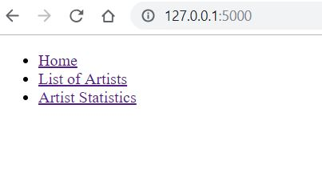
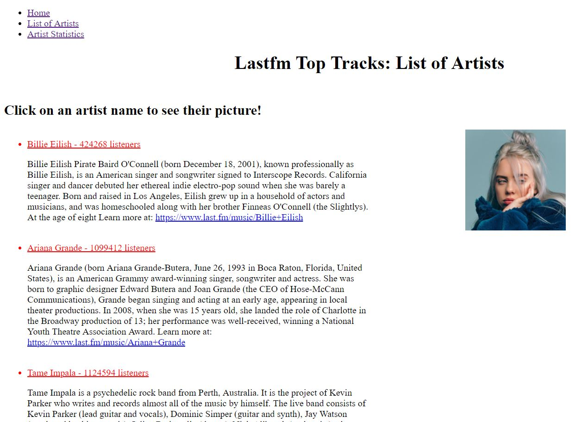

# SI507Final_Project_zinniak

[Link to this repository](https://github.com/zinniak/SI507Final_Project_zinniak)
---
## Project Description
My project is a Flask application that shows details about the top 50 music tracks on the music platform Last.fm. The home shows details about each of the tracks. There is a route to look at the list of all the artists that have songs in the Last.fm top 50 tracks list. Another route shows bar charts of the number of listeners and play count each of these artists have on Last.fm. Users can click on each artist’s name on the artist details route to see their picture. Users can also click on a navigation bar to navigate through the different routes.
## How to run
1.  First, you should install requirement with `pip install -r requirements.txt`.
2.  Second, you should run the `SI507project_tools.py` file to create the necessary files for the Flask application to run.
3.  To run the Flask application, type `python SI507project_app.py runserver` in the command prompt.
4. The application will begin running, open up a tab in a web-browser and type the following in the URL bar: `127.0.0.1:5000`.
## How to use
1.  Click on the links on the top left to navigate to different routes of the application 
2.  On the `List of Artists` page, click on an artist's name to see their image on the left. 

## Routes in this application
-  `/` -> this is the home page, it shows details about the top 50 tracks on the music platform Last.fm
-  `/all_artists` -> this route lists the details of all the artists that have songs on the Last.fm top 50 tracks list. Users can click on an artists name to see their image.
-  `/artist_statistics` -> this route displays bar graphs showing the count of listeners and play counts these artists have on Last.fm.

## How to run tests
1.  Run the `SI507project_tests.py` file.

## In this repository:
* screenshots (Directory)
    * artist_details.JPG
    * navigation.JPG
*  static (Directory)
    * artist_info.js
*  templates (Directory)
    * all_artists.html
    * chart.html
    * index.html
* README.md
* SI507project_app.py
* SI507project_tests.py
* SI507project_tools.py
* database_model.JPG
* requirement.txt
* sample_tracks.db

---
## Code Requirements for Grading
Please check the requirements you have accomplished in your code as demonstrated.
-  [x] This is a completed requirement.
-  [ ] This is an incomplete requirement.
Below is a list of the requirements listed in the rubric for you to copy and paste.  See rubric on Canvas for more details.
### General
-  [x] Project is submitted as a Github repository
-  [x] Project includes a working Flask application that runs locally on a computer
-  [x] Project includes at least 1 test suite file with reasonable tests in it.
-  [x] Includes a `requirements.txt` file containing all required modules to run program
-  [x] Includes a clear and readable README.md that follows this template
-  [x] Includes a sample .sqlite/.db file
-  [x] Includes a diagram of your database schema
-  [x] Includes EVERY file needed in order to run the project
-  [x] Includes screenshots and/or clear descriptions of what your project should look like when it is working
### Flask Application
-  [x] Includes at least 3 different routes
-  [x] View/s a user can see when the application runs that are understandable/legible for someone who has NOT taken this course
-  [x] Interactions with a database that has at least 2 tables
-  [x] At least 1 relationship between 2 tables in database
-  [x] Information stored in the database is viewed or interacted with in some way
### Additional Components (at least 6 required)
-  [x] Use of a new module
-  [x] Use of a second new module
-  [ ] Object definitions using inheritance (indicate if this counts for 2 or 3 of the six requirements in a parenthetical)
-  [ ] A many-to-many relationship in your database structure
-  [ ] At least one form in your Flask application
-  [x] Templating in your Flask application
-  [x] Inclusion of JavaScript files in the application
-  [x] Links in the views of Flask application page/s
-  [ ] Relevant use of `itertools` and/or `collections`
-  [ ] Sourcing of data using web scraping
-  [x] Sourcing of data using web REST API requests
-  [ ] Sourcing of data using user input and/or a downloaded .csv or .json dataset
-  [ ] Caching of data you continually retrieve from the internet in some way
### Submission
-  [x] I included a link to my GitHub repository with the correct permissions on Canvas! (Did you though? Did you actually? Are you sure you didn't forget?)
-  [ ] I included a summary of my project and how I thought it went **in my Canvas submission**!
